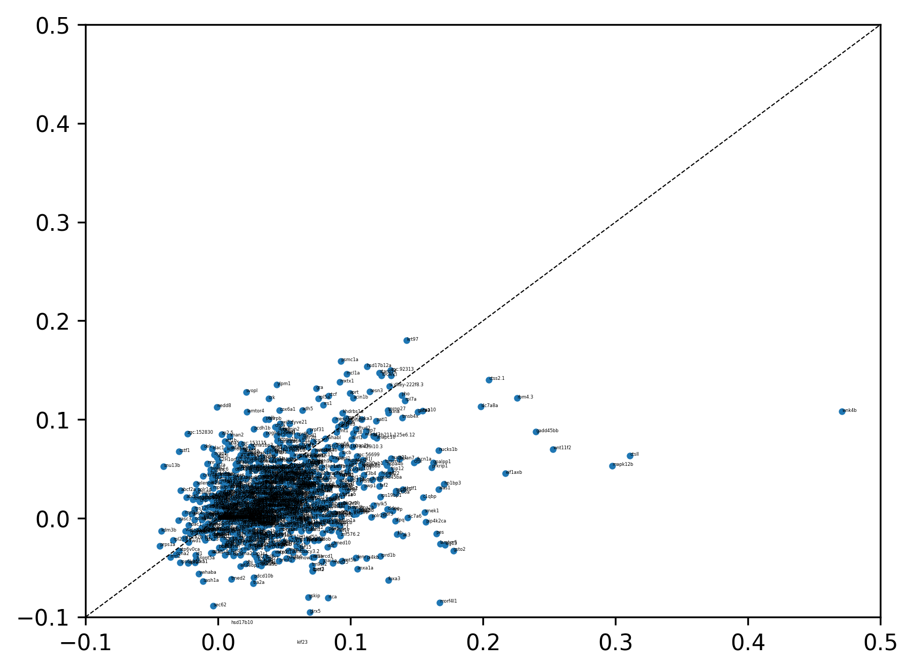

# Bivariate Moran Score for Cross-Platform Tissue Slice Comparison

## Generate a Moran Score for PASTE-aligned slices

invoke the following command:

```
python3 MoranScore.py <h5ad_filename1> <h5ad_filename2> <gene_name>
```

For example, for a slice of the CTFacTomo reconstruction when evaluated on the gene 'gsc', you would run the following command: 

```
python3 MoranScore.py aligned_slices/ctfactomo/reconstructed_slice_31_aligned_with_stereo_slice_2.h5ad aligned_slices/ctfactomo/stereo_slice_2_aligned_with_reconstructed_slice_31.h5ad gsc
```

## Visualize slices and top-contributing spots

```
python3 VisAlignedSlices.py <gene_name> <reconstructed_slice> <stereoseq_slice> <reconstruction_mode> 
```

For the slices of the gene 'gsc' that we previously generated a MoranScore for, you should get something like this when you run the following command:

```
python3 VisAlignedSlices.py gsc 31 2 CTFacTomo 
```


## Visualize the scatter plot for each Stereo-seq slice

```
python3 VisMoranScatterPlots.py <slice_number>
```

For Stereo-seq slice 11 that we want to compare to the CTFacTomo and IPF reconstructions for the top 2000 highly variable genes, you should get the following image when you run the following command:

```
python3 VisMoranScatterPlots.py 11
```




